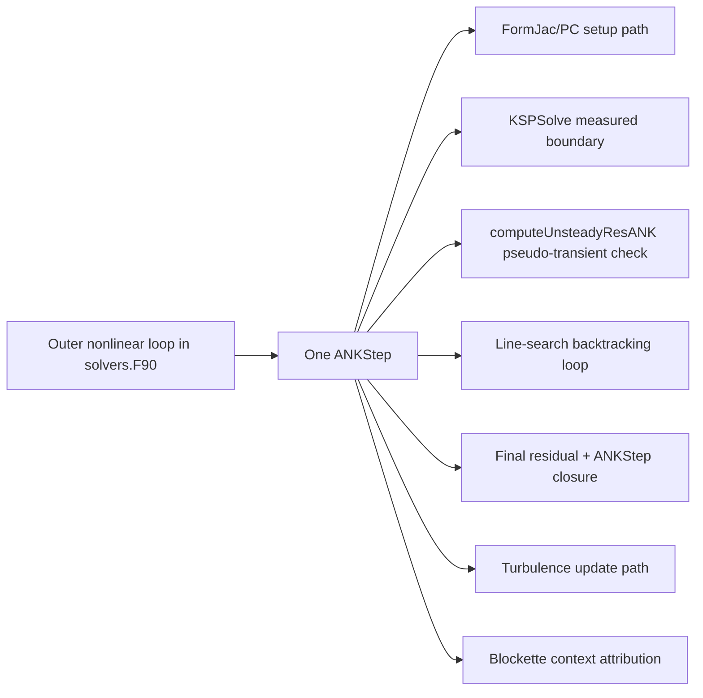

# ANK Step Timing Map (Ultra Detailed, Timer-Insertion Accurate)

This document is a code-anchored, measured-only timing map of the ANK flow.
It is intended to answer all of these questions explicitly:

- where each timer is inserted,
- what each function is doing,
- whether work is compute, communication, data movement/copy, setup/options, or derived remainder,
- where nonlinear loop-back happens,
- where pseudo-transient behavior is introduced,
- what is and is not directly measurable.

This file does not infer PETSc internals beyond observable callback boundaries.

## Legend

- `SEC xx`: profiling section ID from [src/NKSolver/ankProfiling.F90](../src/NKSolver/ankProfiling.F90#L19)
- `timer inserted`: direct `ankProfAddSection(...)` insertion
- `no-call accumulation`: `ankProfAddSectionNoCall(...)`
- operation types:
  - `[compute]`
  - `[comm]`
  - `[copy/vec]`
  - `[setup/options]`
  - `[derived]`

## Measurement Model

1. Measured directly:
- Timers inserted in [src/NKSolver/NKSolvers.F90](../src/NKSolver/NKSolvers.F90)
- Timers inserted in [src/NKSolver/blockette.F90](../src/NKSolver/blockette.F90)
- MG callback timers in [src/solver/amg.F90](../src/solver/amg.F90)

2. Not directly measured (folded into remainder):
- PETSc internal GMRES orthogonalization/norm/restart overhead
- PETSc internal ASM preconditioner internal work when no callback timer wraps it

3. Context attribution source of truth:
- `ankProfSetContext(...)` call sites in [src/NKSolver/NKSolvers.F90](../src/NKSolver/NKSolvers.F90)
- Context-resolved timer rows emitted from `blocketteRes` in [src/NKSolver/blockette.F90](../src/NKSolver/blockette.F90#L357)

## Diagram 0: High-Level Index



---

## Diagram 1: Outer Nonlinear Loop and ANKStep Repetition

Code anchors:
- Nonlinear loop: [src/solver/solvers.F90](../src/solver/solvers.F90#L1044)
- ANKStep calls: [src/solver/solvers.F90](../src/solver/solvers.F90#L1081), [src/solver/solvers.F90](../src/solver/solvers.F90#L1114)

```mermaid
flowchart TD
    A0[nonlinearIteration loop\n[compute/control]] --> A1{switch logic by residual and solver mode\n[compute/control]}
    A1 -->|ANK region| A2[call ANKStep(firstANK)\n[compute/control]]
    A1 -->|other regions| A3[RK or NK path\n[compute/control]]
    A2 --> A4[update monitors and convergence checks\n[compute/control]]
    A4 --> A0
```

Meaning:
- `ANKStep` is executed once per nonlinear iteration while the solver is in the ANK residual window.
- The loop-back that redoes linear solves is outside `ANKStep`, in this outer nonlinear loop.

---

## Diagram 2: One ANKStep, Ordered Phases with Timers

Entry/exit:
- Entry: [src/NKSolver/NKSolvers.F90](../src/NKSolver/NKSolvers.F90#L3784)
- Exit: [src/NKSolver/NKSolvers.F90](../src/NKSolver/NKSolvers.F90#L4434)

```mermaid
flowchart TD
    S0[ANKStep entry\n[compute/control]] --> S1[PC update decision\n[compute/control]]

    S1 --> S2[computeTimeStepMat\nSEC2 timer inserted\n[compute + comm]]
    S2 --> S3[FormJacobianANK_total\nSEC3 timer inserted\n[compute + comm + setup/options]]
    S3 --> S31[FormJac residual assembly\nSEC4 timer inserted\n[compute + comm]]
    S3 --> S32[PC setup\nSEC5 timer inserted\n[setup/options]]

    S32 --> S4[KSP tolerances + residual history\nSEC36 starts later around this block\n[setup/options]]
    S4 --> S5[formFunction_mf base residual + MatMFFDSetBase\nSEC36 timer inserted\n[setup/options + compute + copy/vec]]

    S5 --> S6[KSPSolve\nSEC6 timer inserted\n[compute + comm + derived]]
    S6 --> S61[MatMult in KSPSolve callback\nSEC25/27/28/29 timers inserted\n[compute + comm + copy/vec]]
    S6 --> S62[PCApply measurable callback path\nSEC8 timer inserted (MG callback delta)\n[compute]]

    S6 --> S7[physicality check + state update\nnow absorbed in SEC13 via no-call accumulation\n[compute + copy/vec]]

    S7 --> S8[computeUnsteadyResANK\nSEC10/30/31/32 timers inserted\n[compute + comm + copy/vec]]
    S8 --> S9{unsteady norm acceptable?\n[compute/control]}
    S9 -->|no| S10[line-search backtracking loop\nre-calls computeUnsteadyResANK\n[compute/control]]
    S9 -->|yes| S11
    S10 --> S11

    S11[turbulence update conditional\nSEC24 timer inserted\n[compute]] --> S12[final residual blockette call\nSEC12 timer inserted\n[compute + comm]]
    S12 --> S13[ANKStep closure\nSEC1 timer inserted\n[derived]]
```

---

## Diagram 3: KSPSolve Boundary and Measurable vs Remainder

Anchors:
- KSPSolve call: [src/NKSolver/NKSolvers.F90](../src/NKSolver/NKSolvers.F90#L4139)
- KSPSolve timer insertion: [src/NKSolver/NKSolvers.F90](../src/NKSolver/NKSolvers.F90#L4159)
- PCApply measurable delta insertion: [src/NKSolver/NKSolvers.F90](../src/NKSolver/NKSolvers.F90#L4155)
- Report decomposition: [src/NKSolver/ankProfiling.F90](../src/NKSolver/ankProfiling.F90#L405)

```mermaid
flowchart LR
    K0[KSPSolve_total SEC6\n[timer inserted]\n[compute+comm+derived]] --> K1[Measured branch 1\nMatMult callback in KSP\nSEC25 + SEC27/28/29\n[compute+comm+copy/vec]]
    K0 --> K2[Measured branch 2\nPCApply callback measurable path\nSEC8\n[compute]]
    K0 --> K3[Remainder (derived)\nPETSc internal GMRES and non-callback work\n[derived]]
```

Interpretation:
- `SEC6 = measured branch 1 + measured branch 2 + derived remainder`
- Remainder is useful and real time, but not decomposed into direct sub-timers.

---

## Diagram 4: formFunction_mf Callback Path (Why it costs time)

Anchors:
- Context set for in/outside KSPSolve: [src/NKSolver/NKSolvers.F90](../src/NKSolver/NKSolvers.F90#L2566)
- MatMult subtimers insertion cluster: [src/NKSolver/NKSolvers.F90](../src/NKSolver/NKSolvers.F90#L2600)

```mermaid
flowchart TD
    M0[formFunction_mf called\n[compute/control]] --> M1[set context in/outside KSPSolve\n[setup/options]]
    M1 --> M2[blocketteRes evaluation\nSEC27 sub-part + blockette context rows\n[compute+comm]]
    M2 --> M3[setRVec + vector array operations\nSEC29 contribution\n[copy/vec]]
    M3 --> M4[MatMultAdd with timeStepMat\nSEC28 contribution\n[compute+copy/vec]]
    M4 --> M5[MatMult totals\nSEC7 and SEC25 or SEC26\n[compute+comm+copy/vec]]
```

Purpose:
- Build matrix-free action (`J * v` style path) using residual callback and pseudo-time additions.

Why expensive:
- Repeated many times inside Krylov iterations.
- Includes residual evaluation and communication through blockette/halo paths.

---

## Diagram 5: computeUnsteadyResANK Internals (Pseudo-Transient Behavior)

Anchors:
- Subroutine: [src/NKSolver/NKSolvers.F90](../src/NKSolver/NKSolvers.F90#L2721)
- Total timer insertion: [src/NKSolver/NKSolvers.F90](../src/NKSolver/NKSolvers.F90#L2833)

```mermaid
flowchart TD
    U0[computeUnsteadyResANK entry\n[compute/control]] --> U1[set UNSTEADY context + blocketteRes\nSEC30 timer inserted\n[compute+comm]]
    U1 --> U2[setRVec + VecGetArray/Restore array calls\nSEC32 contribution\n[copy/vec]]
    U2 --> U3[MatMult(timeStepMat, deltaW, unsteadyVec)\nSEC31 timer inserted\n[compute+copy/vec]]
    U3 --> U4[VecAXPY apply pseudo-transient term\nSEC32 contribution\n[copy/vec]]
    U4 --> U5[SEC10 total timer inserted\n[compute+comm+copy/vec]]
```

Purpose:
- Rebuild pseudo-unsteady residual used to accept/reject step size and stabilize nonlinear updates.

How it helps convergence:
- Checks whether post-KSPSolve state update is acceptable under pseudo-transient metric.
- Enables robust line-search damping when residual growth is detected.

Important:
- This is not another linear solve.
- It is a nonlinear acceptance/stabilization evaluation.

---

## Diagram 6: Line-Search Backtracking and Re-entry to computeUnsteadyResANK

Anchors:
- Backtracking loop: [src/NKSolver/NKSolvers.F90](../src/NKSolver/NKSolvers.F90#L4255)
- Repeated computeUnsteady call: [src/NKSolver/NKSolvers.F90](../src/NKSolver/NKSolvers.F90#L4269)
- LINESEARCH context fallback residual: [src/NKSolver/NKSolvers.F90](../src/NKSolver/NKSolvers.F90#L4311)

```mermaid
flowchart TD
    L0[After first computeUnsteady call\n[compute/control]] --> L1{unsteadyNorm too high or NaN?\n[compute/control]}
    L1 -->|yes| L2[restore old state and reduce lambda\n[copy/vec+compute]]
    L2 --> L3[backtrack loop up to 12 attempts\n[compute/control]]
    L3 --> L4[apply tentative step\n[copy/vec]]
    L4 --> L5[re-call computeUnsteadyResANK(lambda)\nSEC10 accumulates repeated calls\n[compute+comm+copy/vec]]
    L5 --> L6{accept?\n[compute/control]}
    L6 -->|no| L3
    L6 -->|yes| L7[continue ANKStep]
    L1 -->|no| L7
```

Key point:
- During this loop, `computeUnsteadyResANK` can run multiple times without re-running `KSPSolve`.

---

## Diagram 7: Blockette Context Attribution (Caller-Origin Truth)

Context set anchors in `NKSolvers`:
- FormJac: [src/NKSolver/NKSolvers.F90](../src/NKSolver/NKSolvers.F90#L1997)
- MatMult in/outside KSP: [src/NKSolver/NKSolvers.F90](../src/NKSolver/NKSolvers.F90#L2566)
- Unsteady: [src/NKSolver/NKSolvers.F90](../src/NKSolver/NKSolvers.F90#L2780)
- Line-search: [src/NKSolver/NKSolvers.F90](../src/NKSolver/NKSolvers.F90#L4311)
- Final residual: [src/NKSolver/NKSolvers.F90](../src/NKSolver/NKSolvers.F90#L4354)
- Turb update: [src/NKSolver/NKSolvers.F90](../src/NKSolver/NKSolvers.F90#L3521)

Context-resolved emission in `blocketteRes`:
- [src/NKSolver/blockette.F90](../src/NKSolver/blockette.F90#L357)

```mermaid
flowchart LR
    B0[blocketteRes totals always\nSEC14/15/16 + SEC18 + SEC17\n[compute+comm]] --> B1{current context}
    B1 -->|FORMJAC| B2[SEC19]
    B1 -->|MATMULT in KSP| B3[SEC33]
    B1 -->|MATMULT outside KSP| B4[SEC34]
    B1 -->|UNSTEADY| B5[SEC21]
    B1 -->|LINESEARCH| B6[SEC22]
    B1 -->|FINALRES| B7[SEC23]
    B1 -->|TURBUPDATE| B8[SEC43]
```

Purpose:
- Separate where residual time is spent by caller origin, while preserving one direct source of residual timing truth.

---

## Diagram 8: Turbulence Update Path (Reduced to Top-Level Timer)

Anchors:
- Turbulence top-level insertion: [src/NKSolver/NKSolvers.F90](../src/NKSolver/NKSolvers.F90#L4344)

```mermaid
flowchart TD
    T0{uncoupled RANS and lambda > 0?\n[compute/control]} -->|no| T3[skip]
    T0 -->|yes| T1[DDADI or KSP turbulence update path\n[compute]]
    T1 --> T2[SEC24 timer inserted\nANK_turbUpdate_total\n[compute]]
```

Notes:
- Detail turbulence subtimers were intentionally removed from reduced reporting view.
- Only top-level turbulence timing is retained.

---

## Timer Insertion Inventory (Active Reduced-Path Focus)

Primary parent and child rows shown in current report:

- `SEC1` ANKStep_total [derived]
- `SEC2` computeTimeStepMat [compute+comm]
- `SEC3` FormJacobianANK_total [compute+comm+setup/options]
- `SEC4` FormJac residual assembly [compute+comm]
- `SEC5` PCSetup [setup/options]
- `SEC6` KSPSolve_total [compute+comm+derived]
- `SEC8` PCApply measurable callback [compute]
- `SEC10` computeUnsteadyResANK_total [compute+comm+copy/vec]
- `SEC12` finalResidual_total [compute+comm]
- `SEC13` localOps_total [accumulated no-call]
- `SEC24` turbUpdate_total [compute]
- `SEC25/27/28/29` KSP matvec branch subtimers [compute/comm/copy]
- `SEC30/31/32` computeUnsteady subtimers [compute+comm+copy]
- `SEC36` outside_KSPSolve_total [setup/options + callback setup work]
- direct blockette totals and context rows `SEC14..23,33,34,43`

## Purpose and Why Time Is Spent (Function-by-Function)

### 1) ANKStep
- Purpose: one nonlinear ANK iteration.
- Why time: orchestration plus large delegated costs (KSPSolve, residual rebuilds, Jacobian/PC updates, final residual).
- Timers: `SEC1` plus parent children.

### 2) computeTimeStepMat
- Purpose: update pseudo-time matrix terms from current state/CFL.
- Why time: loops over grid cells and matrix assembly communication.
- Timer: `SEC2`.

### 3) FormJacobianANK
- Purpose: refresh Jacobian/preconditioner path when needed.
- Why time: residual linearization and PETSc setup/factorization/configuration.
- Timers: `SEC3`, `SEC4`, `SEC5`.

### 4) formFunction_mf
- Purpose: matrix-free action and base residual generation for MFFD.
- Why time: residual evaluation + vector operations + pseudo-time additions.
- Timers: `SEC7`, `SEC25/26`, `SEC27`, `SEC28`, `SEC29`, blockette context rows.

### 5) KSPSolve
- Purpose: solve linearized update for `deltaW` each nonlinear step.
- Why time: repeated callback evaluations + PETSc Krylov internals.
- Timers: `SEC6`, `SEC8`, `SEC25` branch and subtimers, derived remainder.

### 6) computeUnsteadyResANK
- Purpose: pseudo-transient residual check for nonlinear step acceptance/stability.
- Why time: residual eval + matrix-vector product + vector updates.
- Timers: `SEC10`, `SEC30`, `SEC31`, `SEC32`.

### 7) blocketteRes / blocketteResCore
- Purpose: compute residual and communication exchange (halo path), with context tagging.
- Why time: core residual physics loops + halo comm + context accounting.
- Timers: `SEC14`, `SEC15`, `SEC16`, `SEC17`, `SEC18`, and context rows.

### 8) applyShellPC (MG path)
- Purpose: measurable MG preconditioner callback path.
- Why time: multigrid cycles and nested KSP in level-1 case.
- Timers: `SEC45`, `SEC46`, `SEC47` in [src/solver/amg.F90](../src/solver/amg.F90#L516).

## Explicit Caveats (Do Not Over-Claim)

1. `KSPSolve_remainder` is real elapsed time but derived, not a direct PETSc-internal timer.
2. `SEC8` can be near zero for non-MG measurable callback paths.
3. `SEC13` is an accumulation bucket, not a single contiguous function.
4. `computeUnsteadyResANK` is not a second linear solve; it is a nonlinear acceptance/stability residual rebuild.
5. Line-search can add many extra `SEC10` calls without extra `KSPSolve` calls.

## Quick Answers to Common Confusion

- Does computeUnsteadyResANK happen after linear solve?
  - Yes, first call follows `KSPSolve` inside ANKStep, then may repeat in line-search.
- Where is nonlinear loop-back that repeats linear solves?
  - Outside ANKStep in `nonlinearIteration` loop in `solvers.F90`.
- What is outside_KSPSolve_total for?
  - Setup-side cost around tolerances/history + MFFD base residual/base vector setup before Krylov iterations start.
