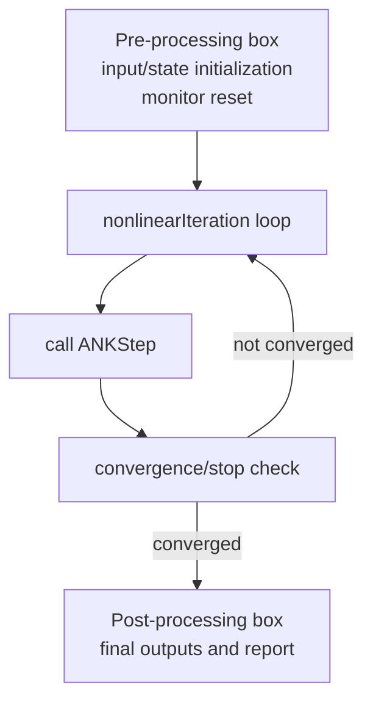
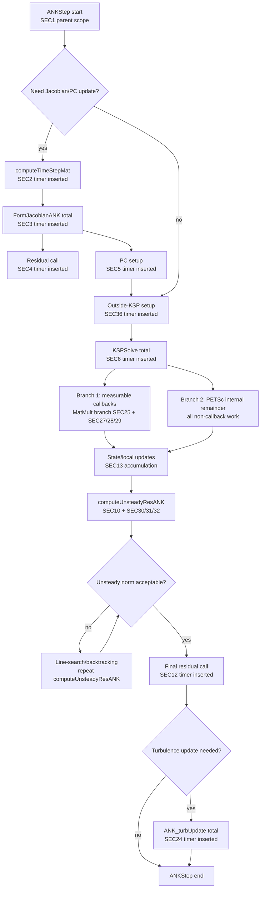

# ANK Timing Flowcharts (Paper Version)

This version is intentionally simplified for publication figures.
It keeps only principal steps, decision points, and timer insertion locations.
Residual evaluations are shown as explicit calls, without internal residual breakdown.

## Diagram A: Nonlinear Loop (ANK-only) with Pre/Post

Notes:
- Only ANK is shown in the nonlinear loop (no RK/NK branches).
- Pre and post boxes are included for paper-level workflow context.

## Diagram B: One ANKStep (Principal Timed Steps)

Notes:
- Residual is explicitly shown where called, but without internal residual decomposition.
- KSPSolve is intentionally split into only two branches:
  - measurable callback branch,
  - PETSc internal remainder branch.

## Timer Labels Included in This Paper View

- SEC1: ANKStep total (parent scope)
- SEC2: computeTimeStepMat
- SEC3: FormJacobianANK total
- SEC4: FormJac residual call
- SEC5: PC setup
- SEC6: KSPSolve total
- SEC10: computeUnsteadyResANK total
- SEC12: final residual call
- SEC13: local updates accumulation
- SEC24: turbulence update total
- SEC25 + SEC27/28/29: measurable KSPSolve callback branch
- SEC30/31/32: computeUnsteady internal timed blocks
- SEC36: outside-KSPSolve setup
