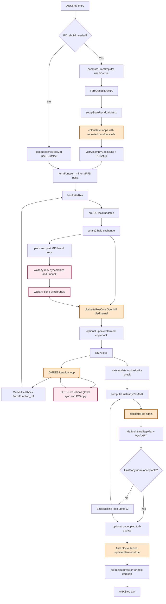
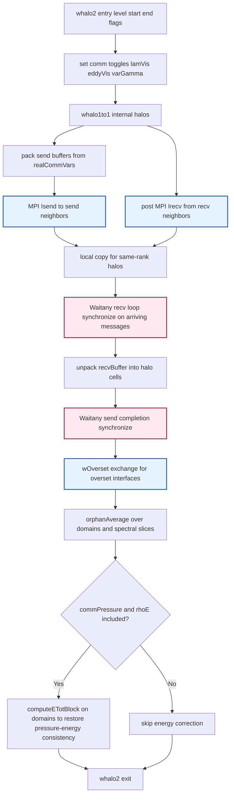

# Implementation-Level Performance Diagnosis: ANK Residual Section

## Scope of this diagnosis
This diagnosis is for the ANK residual path implemented in these routines:
- `src/NKSolver/NKSolvers.F90`: `ANKStep`, `FormFunction_mf`, `computeUnsteadyResANK`
- `src/NKSolver/blockette.F90`: `blocketteRes`, `blocketteResCore`
- `src/utils/haloExchange.F90`: `whalo2` -> `whalo1to1*`/overset comm path
- `src/adjoint/adjointUtils.F90`: `setupStateResidualMatrix` (called by `FormJacobianANK`)

It is not a CFD-theory explanation. It is a cost diagnosis of the implemented code path.

---

## 1) EXECUTION PATH

### 1.1 Entry point and top-level order in one ANK iteration
Within `ANKStep` (`src/NKSolver/NKSolvers.F90`), the dominant performance path is:
1. Optional PC rebuild decision (based on `ANK_jacobianLag` and residual-based trigger).
2. `computeTimeStepMat(usePC=...)`.
3. Optional `FormJacobianANK()`.
4. Matrix-free base setup:
   - `formFunction_mf(ctx, wVec, baseRes, ierr)`
   - `MatMFFDSetBase(...)`
5. Krylov solve: `KSPSolve(ANK_KSP, rVec, deltaW, ierr)`.
6. `physicalityCheckANK`, state update (`VecAXPY`, `setWANK`).
7. `computeUnsteadyResANK(lambda)`.
8. Optional backtracking loop (up to 12 tries) with repeated `computeUnsteadyResANK`.
9. Optional uncoupled turbulence update.
10. Final residual for next iteration: `blocketteRes(useUpdateIntermed=.True.)`.

### 1.2 What dominates inside KSPSolve
In matrix-free mode, each GMRES matvec calls `FormFunction_mf`:
1. `setWANK(inVec, ...)` writes perturbed state into block storage.
2. `blocketteRes(...)` computes residual for perturbed state.
3. `setRVec`/`setRVecANK` packs residual arrays into PETSc vector.
4. `MatMultAdd(timeStepMat, inVec, rVec, rVec)` adds pseudo-time Jacobian term.
5. PETSc vector array access/restore (`VecGetArray*`, `VecRestoreArray*`).

So KSPSolve cost is repeatedly: residual evaluation + vector operations + Krylov orthogonalization/reductions.

### 1.3 Small intro: what is computed inside blockette
Inside blockette, the code is computing one full residual evaluation for the current state (or selected flow/turbulence subset), not just one isolated kernel.

In implementation terms, blockette does four things in sequence:
1. Builds required local physical/derived fields on each block (pressure, laminar viscosity, eddy viscosity, BC-enforced states).
2. Synchronizes halo state across MPI neighbors with `whalo2` so boundary-adjacent stencil points are consistent.
3. Runs tiled residual kernels in `blocketteResCore` to compute inviscid, viscous, turbulence, and time-step related contributions into `dw`.
4. Optionally copies intermediate fields (time step, spectral radii, nodal gradients, speed-of-sound-squared) back to global arrays when `updateIntermed` is enabled.

So from a performance view, blockette is the full residual pipeline for ANK/NK matvec and nonlinear checks: local prep + communication + heavy tile compute + optional data writeback.

### 1.4 What dominates inside blocketteRes
`blocketteRes` executes in this implementation order:
1. For every spectral slice and block: recompute pressure/viscosities and apply BCs.
2. Halo exchange once per residual call: `whalo2(level=1, lStart:lEnd, comm flags)`.
3. Optional BC re-application for overset.
4. Main loops over spectral slices and domains:
   - If `useBlockettes`: `blocketteResCore(...)`.
   - Else fallback `blockResCore(...)`.
5. Optional source terms and optional output-related solution extraction.

Reads/writes and temporary movement:
- Reads large global arrays from block storage into threadprivate tile buffers.
- Writes residual `dw` back to global arrays.
- If `updateIntermed=.True.`, copies `dtl`, `radI/J/K`, `aa`, and 12 nodal gradient arrays back to global memory.

### 1.5 What dominates inside blocketteResCore
OpenMP appears at:
- `!$OMP parallel do private(i,j,k,l) collapse(2)` over `kk` and `jj` tile loops.
- `ii` tile loop remains serial inside each `(kk,jj)` chunk.

Per tile work (BS=8) is:
1. Copy-in stage from global arrays to threadprivate arrays (`w,p,gamma,ss,rlv,rev,vol,x,...`).
2. For `ii>2`, partial reuse by copying tile-end plane from previous tile, then fill the rest from global arrays.
3. Copy porosity/iblank/d2wall/volRef and optional face-velocity arrays.
4. Compute kernels:
   - `metrics`, `initRes`
   - SA turbulence pieces (`saSource`, `saAdvection`, `saViscous`, `saResScale`) if active
   - `timeStep`
   - `inviscidCentralFlux` + selected dissipation/upwind routine
   - viscous path (`computeSpeedOfSoundSquared`, optional `allNodalGradients`, `viscousFlux`/`viscousFluxApprox`)
   - `sumDwAndFw`
5. Copy-out residual `dw` to global `bdw`.
6. Optional copy-out of intermediate arrays (`bdtl`, `bradi/j/k`, `baa`, `bux..bqz`).

### 1.6 MPI and synchronization entry points
- Halo communication in this section enters primarily at `whalo2` from `blocketteRes`.
- `whalo2` calls 1-to-1 and overset exchange routines using nonblocking `MPI_Isend`/`MPI_Irecv` and completion with `MPI_Waitany` loops.
- PETSc `KSPSolve` introduces global synchronization via Krylov dot-product/norm reductions (inside PETSc internals).
- `setupStateResidualMatrix` introduces matrix assembly synchronization (`MatAssemblyBegin/End`), with communication time explicitly tracked there.

### 1.7 External libraries
- PETSc: `KSP`, `MatMFFD`, `MatMult`, `MatMultAdd`, `Vec*`, `MatAssembly*`.
- MPI: halo communication and PETSc internal collectives.
- OpenMP: tile-loop parallel region in `blocketteResCore`.

---

## 2) OPERATION TYPE CLASSIFICATION

### 2.1 `blocketteResCore` tile kernel
Likely bottleneck ranking:
1. Memory traffic and cache pressure (copy-in/copy-out plus many streamed arrays).
2. Arithmetic throughput in flux/turbulence kernels (substantial but fed by memory).
3. Instruction mix/vectorization limits (conditionals, mixed loops, many arrays).
4. OpenMP load/scheduling overhead (secondary).

Type classification:
- Mixed arithmetic + memory bandwidth.
- Cache locality limited in parts.
- Instruction-efficiency limited in parts (SIMD challenges).

### 2.2 `whalo2` communication in each residual call
Likely bottleneck ranking:
1. Network latency at high rank counts (many neighbor exchanges and Waitany completions).
2. Communication bandwidth for large halo payloads.
3. Packing/unpacking and local copies.

Type classification:
- Communication dominated.
- Synchronization/wait dominated.
- Latency sensitive as decomposition gets finer.

### 2.3 `FormFunction_mf` during KSPSolve
Likely bottleneck ranking:
1. Repeated full residual calls (dominates matvec cost).
2. PETSc vector/matrix operations and memory movement.
3. Global reductions in Krylov internals (not in this routine body but in KSPSolve loop).

Type classification:
- Mixed residual-compute + communication.
- Allocation/copy and vector-op overhead non-negligible.
- Synchronization/reduction effects from Krylov iterations.

### 2.4 `setupStateResidualMatrix` during PC rebuild
Likely bottleneck ranking:
1. Repeated residual evaluations per color and per state variable.
2. Matrix insertion/assembly communication (`MatAssembly*`).
3. Temporary allocation/deallocation and state reset loops.

Type classification:
- Compute + communication + allocation/copy dominated.
- Serial dependency in color/state loops.

---

## 3) ARITHMETIC COST

### 3.1 Expensive operation families present
Hot arithmetic in this section is not uniform; it is a mixture of cheap stencil algebra and expensive nonlinear transport/time-scale terms.

- Divisions: high likelihood in time-step, viscous scaling, metric normalization, and turbulence source scaling (multiple reciprocal operations per cell in active viscous+turbulence paths).
- Square root or equivalent nonlinear magnitude operations: moderate likelihood in wave-speed/spectral-radius style terms and turbulence model limiting terms.
- Turbulence nonlinearities: high likelihood and high cost variability in SA source/advection/viscous pieces, including clipping/limiting and branch-dependent coefficients.
- Expensive transcendental functions: low-to-moderate likelihood from this call graph alone; no direct evidence here that transcendental functions dominate, but if present inside called turbulence/transport kernels they are high-latency and vectorization-sensitive.
- Branch-heavy arithmetic: high likelihood due to discretization choice (central/upwind/dissipation variants), viscous on/off logic, turbulence on/off logic, and overset/blanking conditions.

Diagnosis: expensive arithmetic exists, but the dominant arithmetic penalty is nonlinear, branchy kernel composition under large data movement.

### 3.2 Is arithmetic the main issue?
Arithmetic cost is substantial in flux and turbulence kernels, but section-level runtime is not primarily flop-limited.

- In `blocketteResCore`, arithmetic work scales with active physics, but copy-in/copy-out plus multi-array streaming keeps effective flop utilization below peak.
- In `FormFunction_mf`/`computeUnsteadyResANK`, arithmetic outside residual kernels is secondary to residual invocation count.
- In `setupStateResidualMatrix`, arithmetic volume can become large, but mostly because residual kernels are repeated many times (color/state loops), not because one invocation has extreme arithmetic intensity.

Conclusion: arithmetic is important locally inside hot kernels, but globally this section is dominated by residual count multiplied by mixed memory+communication cost.

### 3.3 Arithmetic intensity and compute-bound zones
Refined intensity classification:

- Core flux/turbulence kernel window after tile staging: medium intensity.
- Full `blocketteResCore` tile cycle including staging and copy-out: low-to-medium intensity.
- Full residual path `blocketteRes` including halo and synchronization: low effective intensity on the wall-clock critical path.

Reason:
Let arithmetic intensity be $I = \frac{\text{FLOPs}}{\text{bytes moved}}$. The implementation increases the denominator strongly via staging buffers, many simultaneously streamed fields, and optional intermediate writeback. Even if local compute in flux/turbulence is dense, section-level $I$ is depressed by non-compute bytes and synchronization pauses.

Practical regime call:
- Single node, large blocks, viscous+turbulence active: mixed, often memory-limited with compute-sensitive subregions.
- Strong scaling / many ranks: communication and synchronization reduce effective intensity further; compute optimization alone has diminishing return.

### 3.4 SIMD friendliness
Vectorization is plausible in portions of inner loops but likely fragile and frequently degraded.

Primary SIMD blockers:
- Branchy option-dependent control flow inside hot paths.
- Many routine boundaries in inner execution path, reducing inlining opportunities and whole-loop vector reasoning.
- Large set of arrays with mixed reuse patterns, increasing register pressure and boundary-address complexity.
- Conditional reuse logic across tiles (`ii` progression) that complicates uniform vector lanes.
- Turbulence and limiter logic that can introduce mask-heavy execution.

Expected outcome:
- Partial vectorization in simple contiguous copy and some flux algebra loops.
- Lower SIMD efficiency in fully featured viscous+turbulence branches.
- Compiler-report validation is still required, but static structure suggests vectorization is not robust end-to-end.

### 3.5 What runs inside blockettes besides arithmetic
For paper clarity, the blockette path is not only math kernels; it is a mixed execution pipeline with several non-arithmetic code classes:

1. Data staging and marshaling code (dominant non-math cost)
- Copy-in from global block arrays to tile-local/threadprivate arrays before kernel calls.
- Copy-out of residual arrays, and optional copy-back of many intermediate fields when `updateIntermed=.True.`.
- Cost signature: bandwidth and cache-pressure dominated; raises bytes moved per useful flop.

2. Communication orchestration code
- Halo exchange setup, pack/unpack, and message progression through `whalo2` and 1-to-1/overset paths.
- Uses nonblocking calls but still has completion loops (`MPI_Waitany`) and synchronization tails.
- Cost signature: latency/synchronization dominated at strong scaling.

3. Control and dispatch code
- Option-dependent branch paths (flow/turbulence/viscous/discretization choices).
- Routine dispatch across many kernel boundaries and model-specific branches.
- Cost signature: branch divergence, instruction-cache churn, weaker vectorization robustness.

4. Parallel runtime and synchronization code
- OpenMP scheduling and barrier behavior around collapsed tile loops.
- PETSc Krylov collective synchronization outside the tile kernel but on the same residual critical path.
- Cost signature: thread-level and rank-level waiting that does not contribute new physics work.

5. Boundary/overset consistency code
- BC reapplication, blanking/porosity handling, and overset consistency operations.
- These are correctness-critical but add irregular memory access and branch-heavy control.

Practical conclusion: inside blockettes, arithmetic kernels are only one component of runtime. The full cost is a coupled mix of math + data movement + control + synchronization, which is why reducing residual count and data movement often outperforms isolated math-kernel tuning.

---

## 4) MEMORY TRAFFIC AND CACHE

### 4.1 Access patterns
- Global-to-tile copy-in is mostly contiguous in Fortran-first dimension for inner `i` loops, but many separate arrays are streamed together.
- Tile reuse exists only for the leading planes between consecutive `ii` tiles (`w(BS+i,...) -> w(i,...)`, etc.).
- Indirect/scattered behavior appears in halo packing/unpacking and matrix assembly code paths.

### 4.2 Arrays streamed together
`blocketteResCore` concurrently touches a large set:
- State/thermo: `w,p,gamma,ss`
- Geometry/metrics: `x,sI,sJ,sK`
- Viscosity/turb/time-step: `rlv,rev,dtl,radI/J/K,dss`
- Gradients: 12 arrays `ux..qz`
- Residual/flux buffers: `dw,fw`
- Misc masks/porosity: `iblank,porI/J/K`

This wide working set can exceed private cache residency for effective reuse, especially with multiple threads.

### 4.3 Cache behavior expectations
- L1/L2: useful for tile-local compute phases after copy-in.
- L2/L3: pressured by number of arrays and threadprivate duplication.
- DRAM: significant traffic from repeated copy-in/out and `updateIntermed` copy-back of many fields.

`updateIntermed=.True.` is particularly expensive for memory traffic because it writes multiple full-size 3D fields back to global memory after every relevant residual.

### 4.4 Bandwidth vs cache bound conclusion
Most likely for this section:
- `blocketteResCore` is memory-system limited in many regimes (cache+bandwidth mixed).
- It is not purely DRAM-streaming all the time because tile buffers help, but copy stages and large field count keep pressure high.
- Multi-thread runs likely become shared-memory bandwidth sensitive.

Evidence in code:
- Explicit copy-in/out loops over many arrays.
- Optional full-field copy-back of intermediate arrays.
- Threadprivate large temporary arrays per OpenMP thread.

---

## 5) COMMUNICATION AND SYNCHRONIZATION

### 5.1 Halo exchange mechanics
Each `blocketteRes` executes one halo exchange:
- `whalo2(...)` with variable range `lStart:lEnd`.
- Internally uses nonblocking sends/receives and `MPI_Waitany` completion.
- Also includes overset exchange and orphan handling where applicable.

Implementation detail of where communication is actually issued:
1. `blocketteRes` calls `whalo2(level, start, end, commPressure, commGamma, commViscous)`.
2. `whalo2` dispatches to 1-to-1 exchange (`whalo1to1...`) and overset exchange (`wOverset`).
3. In 1-to-1 exchange, each neighbor path does:
   - pack from `flowDoms(... )%realCommVars(k)%var(...)` into contiguous `sendBuffer`;
   - post `MPI_Isend` for each send-neighbor;
   - post `MPI_Irecv` for each recv-neighbor;
   - perform same-rank local copies;
   - synchronize receive completion via `MPI_Waitany` loop and unpack to halo cells;
   - synchronize send completion via `MPI_Waitany` loop.

### 5.2 What is communicated
- Cell-centered state subsets (`start:end`) plus optional pressure/gamma/viscosity-related fields depending on flags and physics options.
- Message sizes depend on interface area and communicated variable count.

More concrete payload structure in this section:
- Message scalar count per neighbor is effectively `nVar * nSendCellsToNeighbor` (or recv equivalent).
- `nVar` is controlled by `start:end` and by optional comm flags (`commPressure`, variable gamma path, laminar/eddy viscosity).
- Communication is nearest-neighbor interface exchange; no all-to-all pattern in halo path.
- Overset exchange adds non-1to1 donor/fringe communication with its own send/recv lists.

### 5.3 Blocking vs non-blocking and overlap
- Calls are nonblocking (`Isend/Irecv`), but immediate completion loops (`Waitany`) are used in the same phase.
- Practical overlap with useful compute in this section is limited; after posting comm, code proceeds to completion and unpack.

Synchronization detail:
- Nonblocking is used for progress flexibility, but algorithmically this phase is still synchronization-heavy because unpack cannot proceed before matching receives complete.
- Receive-side `Waitany` loop serializes unpack in arrival order, which can expose tail latency from the slowest neighbors.
- A second `Waitany` loop ensures all sends completed before leaving the exchange routine.

### 5.4 Synchronization points
- MPI waits in halo completion loops.
- PETSc Krylov reductions (global synchronization frequency scales with iteration count).
- PETSc matrix assembly begin/end in PC setup.
- OpenMP barrier at end of parallel do in `blocketteResCore`.

Explicit synchronization map in this section:
1. Point-to-point sync (in halo exchange):
   - `MPI_Waitany` recv-completion loop in halo routines.
   - `MPI_Waitany` send-completion loop in halo routines.
2. Global sync (inside PETSc Krylov path):
   - Dot products and norm checks in GMRES iterations imply collective reductions.
   - These are frequent and become dominant at high rank count / low work per rank.
3. Assembly sync:
   - `MatAssemblyBegin/End` in Jacobian/PC build includes communication and global coordination semantics.
4. Thread-level sync:
   - implicit OpenMP barrier at end of `parallel do` over tiles.

### 5.5 Latency vs bandwidth sensitivity
- At lower process counts with large domains per rank: bandwidth matters more.
- At high process counts / strong scaling: latency and synchronization dominate, because halo messages get smaller and more frequent and Krylov reductions stay global.

Scaling degradation is likely from both communication volume and synchronization frequency, with latency/sync becoming dominant at fine decompositions.

### 5.6 Where waiting is likely to accumulate
Most likely waiting hotspots in this implementation:
1. Receive completion tail in halo exchange when one or a few neighbors are late.
2. Krylov global reductions each linear iteration (all ranks must participate).
3. Matrix assembly completion during PC rebuild phases.

This is why runtime can degrade even when per-rank compute appears reduced: communication steps retain hard synchronization points.

### 5.7 Residual-cost model (analysis)
For this section, wall time is driven by how many full residual evaluations are executed and what each residual costs on the critical path.

Per ANK step, approximate residual-call count:

$$
N_{res} \approx N_{base} + N_{ksp\_matvec} + N_{unsteady} + N_{line\_search} + N_{final} + N_{pc\_rebuild}
$$

Where, from the implementation:
- $N_{base}=1$ from base residual setup for matrix-free path.
- $N_{ksp\_matvec}\approx$ GMRES iteration count (one residual-style action per matvec callback).
- $N_{unsteady}=1+N_{backtrack}$ because unsteady residual is recomputed on each backtrack trial.
- $N_{line\_search}$ contributes extra fallback residual evaluations when line search fails.
- $N_{final}=1$ for end-of-step residual refresh.
- $N_{pc\_rebuild}$ can be large during Jacobian/preconditioner rebuild due to coloring/state loops.

So total step cost has multiplicative sensitivity to linear iterations and rebuild frequency:

$$
T_{step} \sim N_{res}\,\bar{T}_{res} + T_{krylov\_global\_sync} + T_{pc\_assembly\_sync} + T_{other}
$$

Per residual call decomposition:

$$
T_{res} = T_{pre\_local} + T_{halo} + T_{core} + T_{copy\_out}
$$

- $T_{pre\_local}$: pressure/viscosity recompute + BC work.
- $T_{halo}$: MPI pack/post/wait/unpack path in halo exchange.
- $T_{core}$: tiled blockette kernel compute + memory movement.
- $T_{copy\_out}$: residual/intermediate writeback (large when updateIntermed is enabled).

Key diagnosis: this code path is expensive because both factors are high: large $N_{res}$ and nontrivial $T_{res}$.

### 5.8 Communication critical-path model (analysis)
The halo path is nonblocking at API level, but critical-path behavior is dominated by completion waits. A practical model is:

$$
T_{halo} \approx T_{pack} + T_{post} + T_{local\_copy} + T_{recv\_tail} + T_{unpack} + T_{send\_complete}
$$

with

$$
T_{recv\_tail} \approx \max_{n\in neighbors}\left(\alpha_n + \frac{m_n}{B_n} + \delta_n\right)
$$

- $\alpha_n$: neighbor latency term.
- $m_n/B_n$: transfer time for neighbor message size and effective bandwidth.
- $\delta_n$: imbalance/jitter/progress delay.

Why this matters here:
- `MPI_Waitany` receive loop exposes arrival-order variability; unpacking progresses as messages arrive, but total stage time still tracks slow neighbors.
- Send completion wait adds another synchronization boundary before exiting exchange routine.
- Overset exchange adds additional neighbor sets and potential long-tail behavior.

Therefore communication slowdown is not only volume-driven; it is tail-latency and synchronization driven.

### 5.9 Residual-compute vs communication regime map
Regime A (coarse decomposition, large cells per rank):
- $T_{core}$ and memory traffic dominate.
- Communication is mostly bandwidth term.

Regime B (moderate decomposition):
- Mixed regime; halo wait tails and Krylov reductions begin to compete with compute.

Regime C (strong scaling, small cells per rank):
- Synchronization dominates: halo receive tails + global Krylov reductions.
- Compute becomes too small to hide communication.

Observed implication for this implementation:
- Reducing GMRES iterations often gives larger gains than micro-optimizing a single inner loop, because it reduces both residual calls and associated communication/sync events.

### 5.10 Residual and communication bottleneck ranking by leverage
If optimizing this section only, highest-impact levers are:
1. Lower residual call count per ANK step (fewer matvec/backtrack/rebuild evaluations).
2. Reduce residual-call communication critical path (smaller halo payload or better overlap/neighbor balance).
3. Reduce residual-call memory movement (copy-in/out and updateIntermed footprint).

This ranking follows directly from the cost structure:

$$
\frac{\partial T_{step}}{\partial N_{res}} \gg \frac{\partial T_{step}}{\partial \text{small kernel flop improvement}}
$$

in communication/synchronization-sensitive runs.

---

## 6) LOAD BALANCE AND PARALLEL EFFICIENCY

### 6.1 MPI rank-level balance
Work per rank depends on block ownership and interface complexity.
Potential imbalance sources:
- Different block sizes/shapes.
- Different overset/blanked-cell fractions.
- Different boundary condition complexity per rank.

Ranks with heavier boundary/overset work can delay global progress at waits and reductions.

### 6.2 OpenMP thread-level balance
OpenMP uses collapsed `(kk,jj)` loops; `ii` remains serial inside each chunk.
Implications:
- Parallel granularity is number of `(kk,jj)` tile strips.
- If `(kk,jj)` space is small or uneven, thread utilization degrades.
- Tail tiles with reduced extents can create uneven per-thread work.

### 6.3 Duplication and overhead
- Halo regions and repeated copy-in/out duplicate data movement relative to pure compute needs.
- Repeated residual evaluations in line search and PC coloring amplify imbalance effects.

### 6.4 Strong-scaling limits
Likely limits:
- Inter-node: halo latency + PETSc global reductions.
- Intra-node: memory bandwidth saturation and threadprivate working-set pressure.
- Too little work per rank/thread causes overhead dominance.

---

## 7) CPU VS GPU SUITABILITY

### 7.1 Characteristics from implementation
This section has a GPU-challenging execution shape:

- Kernel fragmentation: many short/medium routines per residual (prep, halo, multiple physics kernels, copy-back).
- Routine-boundary density: deep call chain reduces fusion opportunities and increases launch/coordination overhead risk.
- Repeated host-side communication/synchronization: halo exchange plus Krylov collectives impose frequent global or neighbor waits.
- Section-level arithmetic intensity: low-to-medium after staging/copy/communication are included.
- Large temporary staging footprint: extensive tile-local/threadprivate buffers and many field arrays.
- Branchy option-dependent paths: discretization/physics toggles create divergent execution behavior.
- Hard dependency on halo exchange and Krylov reductions: limits asynchronous throughput gains.

### 7.2 Hardware fit judgment
- Current best fit: CPU nodes with strong memory bandwidth, large cache, and low-latency interconnect.
- Why CPU currently wins: execution is synchronization-coupled and data-movement-heavy; the critical path is not a single large fused arithmetic kernel.

Why GPU is not immediately favorable:
- Fragmented kernels and many routine boundaries reduce fusion and sustained occupancy.
- Repeated halo and Krylov synchronization create frequent host/device or inter-rank coordination points.
- Low-to-medium section-level intensity limits payoff from high peak FLOP rate.
- Large staging and copy phases inflate memory traffic.
- Branch-heavy paths degrade SIMD/SIMT efficiency.

What would be required for a strong GPU case:
- kernel fusion across residual phases,
- reduced staging and copy-back volume,
- data-layout changes for contiguous high-throughput access,
- communication-computation overlap redesign,
- PETSc and nonlinear loop restructuring for end-to-end device residency and lower synchronization frequency.

Bottom line: GPU viability is an algorithm-structure problem first, not only a porting problem.

---

## 8) MAIN BOTTLENECKS (RANKED)

1. Repeated full residual evaluations (`blocketteRes`) in matvecs, unsteady checks, line search, and PC setup.
- Why costly: multiplies all compute + halo + copy costs.
- Algorithmic or implementation: both (matrix-free strategy + current implementation structure).
- Scaling impact: worsens with GMRES iterations and rank count.
- Limitation type: code-design and communication sensitivity.

2. Memory traffic in `blocketteResCore` copy-in/copy-out and intermediate-field writeback.
- Why costly: streams many arrays, large writeback footprint, shared bandwidth pressure.
- Algorithmic or implementation: implementation-heavy.
- Scaling impact: worsens intra-node with threads.
- Limitation type: memory subsystem and data-movement design.

3. Halo communication (`whalo2`) once per residual call.
- Why costly: per-call exchange and waits; repeated often.
- Algorithmic or implementation: algorithm-required communication, implementation has limited overlap.
- Scaling impact: worsens strongly at high rank counts.
- Limitation type: network latency/bandwidth + synchronization.

4. Krylov global reductions and PETSc synchronization.
- Why costly: global collectives per iteration limit parallel efficiency.
- Algorithmic or implementation: algorithmic to Krylov methods, partially tunable.
- Scaling impact: worsens with process count.
- Limitation type: global synchronization.

5. PC assembly path (`setupStateResidualMatrix`) with color/state loops and matrix assembly.
- Why costly: many perturb-residual cycles + matrix insertion/assembly communication.
- Algorithmic or implementation: both.
- Scaling impact: expensive periodic spikes; can dominate rebuild steps.
- Limitation type: repeated work + assembly communication.

---

## 9) POSSIBLE IMPROVEMENTS

## A) Code-level improvements
1. Reduce copy passes in `blocketteResCore`.
- Fuse copy and compute where safe, or compute directly from global arrays for select fields.
- Reassess which arrays truly need threadprivate staging.

2. Minimize `updateIntermed` footprint.
- Copy back only fields needed by the immediate next phase.
- Delay or conditionalize gradient/speed-of-sound writeback when not consumed.

3. Increase effective tile locality.
- Re-tune `BS` for target CPU cache sizes.
- Consider asymmetric block sizes if one dimension dominates reuse.

4. Improve SIMD friendliness.
- Hoist conditionals outside inner loops when possible.
- Specialize kernels for common option combinations to reduce branchy generic paths.
- Encourage inlining of small hot routines.

5. Reduce avoidable vector churn in `computeUnsteadyResANK`.
- Avoid duplicate create/destroy cycles for temporary vectors if reusable across iterations.

## B) Parallelization improvements
1. Better overlap in halo exchange path.
- Post receives/sends earlier and perform independent local work before wait completion when possible.

2. OpenMP work partition tuning.
- Revisit collapse strategy and schedule policy for better balance on irregular block sizes.
- Investigate parallelizing or chunking `ii` work if safe.

3. Krylov iteration reduction.
- Tune preconditioner freshness (`ANK_jacobianLag`, update criteria) to reduce matvec count without overpaying rebuild cost.
- Evaluate solver/preconditioner settings that reduce global reduction count per nonlinear step.

4. Rank decomposition tuning.
- Partition to reduce surface/volume ratio and overset-induced imbalance.

## C) Hardware-related improvements
1. Prefer CPUs with higher memory bandwidth per socket and large LLC.
2. Use fewer, faster cores when memory bandwidth saturates before all cores scale.
3. Improve NUMA placement (first-touch, binding) to reduce remote-memory penalties.
4. For multinode runs, prioritize low-latency interconnect due to frequent halo and Krylov synchronization.

---

## 10) FLOWCHART

### 10.1 ANK residual-section flow

### 10.2 WHALO2 communication flow

---

## 11) FINAL DIAGNOSIS

- Main cost type: repeated residual-evaluation cost dominated by memory traffic + halo communication.
- Secondary cost type: Krylov synchronization/reduction overhead and periodic PC assembly spikes.
- Why this section takes time: each nonlinear step triggers many `blocketteRes` executions (base, matvec iterations, unsteady checks, line search, final residual, plus color-loop rebuilds), and each execution includes both heavy tile-kernel memory movement and one halo exchange.
- What limits scaling: increasing communication/synchronization (halo waits + Krylov global reductions) and shared-memory bandwidth pressure.
- Best-suited hardware: high-bandwidth CPU nodes with strong cache hierarchy and low-latency network.
- Most promising optimization: reduce number and cost of full residual evaluations (better nonlinear/linear iteration economics and lighter residual path via reduced data movement and selective intermediate-field updates).
